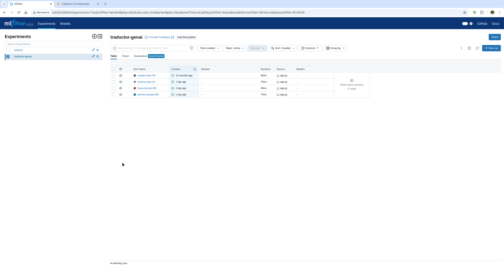
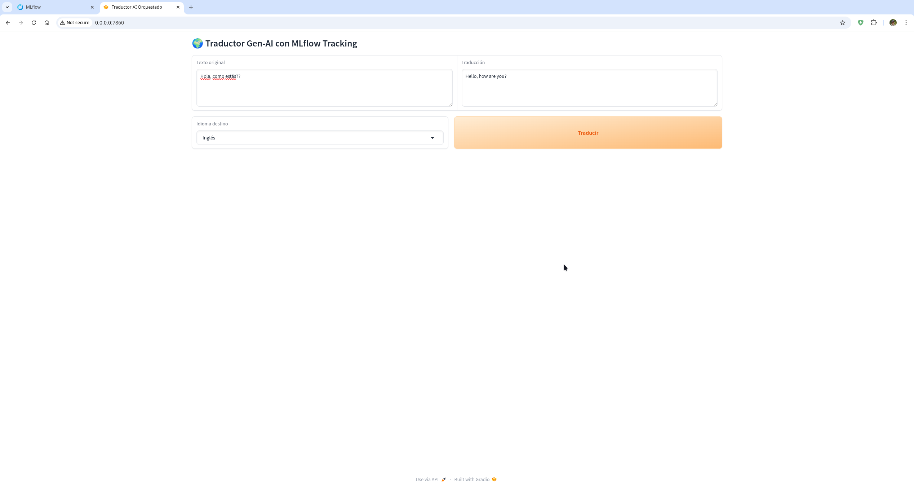

# Taller: App de Traducción Orquestada con Docker Compose y Swarm




## Arquitectura
La aplicación consta de dos servicios principales:
1.  **app-traductor**: Aplicación Python que utiliza Gradio para la interfaz de usuario y llama a la API de OpenAI (u otro proveedor compatible) para traducir texto. Registra métricas y artefactos en MLflow.
2.  **mlflow-server**: Servidor de MLflow que almacena el historial de experimentos, métricas y artefactos.

## Diferencias clave: Docker Compose vs Docker Stack

| Característica | docker-compose.yml | docker-stack.yml |
| :--- | :--- | :--- |
| **Propósito** | Desarrollo y pruebas locales | Despliegue en producción (Swarm) |
| **Imagen** | Usa `build: .` para construir localmente | Usa `image: ...` descargada de Docker Hub |
| **Red** | `driver: bridge` (por defecto) | `driver: overlay` (necesario para Swarm) |
| **Despliegue** | Instancias simples (`container_name`) | Réplicas y políticas (`deploy`, `replicas`) |
| **Volúmenes** | Persistencia local simple | Persistencia ligada al nodo (se limita MLflow al manager) |

## Comandos Principales

### Parte C: Desarrollo Local con Docker Compose

1.  **Exportar API Key**:
    ```bash
    export API_KEY="tu_api_key_aqui"
    ```

2.  **Levantar el stack**:
    ```bash
    docker-compose up --build
    ```

3.  **Verificar**:
    -   Gradio: http://localhost:7860
    -   MLflow: http://localhost:5000

4.  **Publicar Imagen**:
    ```bash
    docker login
    docker tag traductor-genai_app-traductor tu_usuario/traductor-genai:1.0.0
    docker push tu_usuario/traductor-genai:1.0.0
    ```

### Parte D: Despliegue en Swarm

1.  **Inicializar Swarm** (si no está activo):
    ```bash
    docker swarm init
    ```

2.  **Desplegar Stack**:
    ```bash
    docker stack deploy -c docker-stack.yml traductor_stack
    ```

3.  **Ver servicios**:
    ```bash
    docker stack services traductor_stack
    ```

4.  **Escalar aplicación**:
    ```bash
    docker service scale traductor_stack_app-traductor=3
    ```

## Observaciones
-   **Latencia**: La primera petición puede ser más lenta debido a la conexión inicial con la API.
-   **Persistencia**: En este entorno Swarm simple, MLflow está restringido al nodo manager para mantener la integridad de la base de datos SQLite local.

